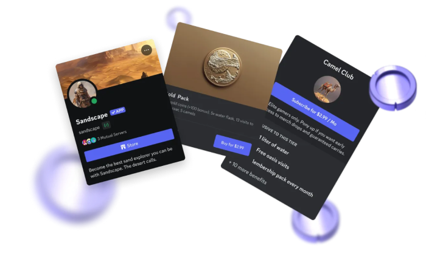

# Discord Entitlement Dashboard

[](https://nuxt.com)
[](https://discord.com/developers/docs)
[](https://docs.discord.com/developers/platform/app-monetization)
[](https://docker.com)
[](https://typescriptlang.org)
[](https://opensource.org/licenses/MIT)

Web dashboard to manage [Entitlements](https://docs.discord.com/developers/resources/entitlement) for a Discord App. List, filter, delete and create test entitlements without slash commands.


## What are Premium Apps & Activities?

**Premium Apps & Activities** is Discord's monetization system for developers. It lets you charge users or servers for premium features inside your Discord app:

- **App Subscriptions** — recurring billing, per user or per server (guild)
- **One-time purchases** — single payment for a permanent item or feature unlock

When a user or guild pays, Discord creates an **Entitlement** — the record that grants access. This dashboard manages those entitlements directly via the Discord API.



## Features

- Multi-app support: save and switch between multiple Discord apps from the header; credentials validated against Discord before saving; app name fetched automatically
- List all entitlements with filters (guild, user, SKU, expired, deleted)
- Export filtered entitlements to CSV (id, type, SKU name, user, guild, dates)
- Delete test entitlements (type `TEST_MODE_PURCHASE` or API-created)
- Create test entitlements with SKU selector
- Guild name resolution (bot member + widget fallback)
- Stats overview: total / active / test / expired
- Copy IDs to clipboard
- Persistent filter preferences (localStorage)
- Sorting on key columns

## Stack

- [Nuxt 3](https://nuxt.com) (v4 compat mode) + TypeScript
- [Nuxt UI v3](https://ui.nuxt.com)
- [Pinia](https://pinia.vuejs.org)
- [Docker](https://docker.com)

## Requirements

- Node.js 20+
- A Discord Bot Token and its Application ID

> **Discord monetization prerequisites:** your app must be [verified](https://support-dev.discord.com/hc/en-us/articles/23926564536471), owned by a [developer team](https://discord.com/developers/teams), and have [monetization enabled](https://docs.discord.com/developers/monetization/enabling-monetization) before entitlements can exist. See the [eligibility checklist](https://docs.discord.com/developers/monetization/enabling-monetization#step-2-complete-the-eligibility-checklist) for full requirements.

## Development

```bash
npm install
npm run dev
```

→ <http://localhost:3000>

## Docker

```bash
cp .env.example .env
docker compose up --build
```

→ <http://localhost:4545>

## Environment variables

| Variable | Default | Description        |
|----------|---------|--------------------|
| `PORT`   | `4545`  | Docker host port   |

## Security

The bot token only transits between the browser and the local Nuxt server. It is never sent to third-party servers. Use HTTPS in production.

## Contributing

See [CONTRIBUTING.md](CONTRIBUTING.md). Commits must follow [Conventional Commits](https://www.conventionalcommits.org/en/v1.0.0/):

```text
feat: add guild filter
fix: token not cleared on logout
docs: update env variables table
ci: add docker build workflow
chore: bump nuxt to 3.16
```

## License

MIT
